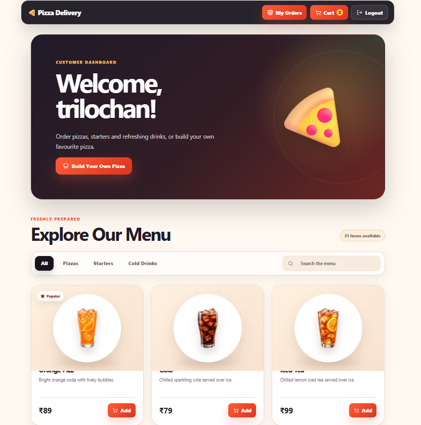
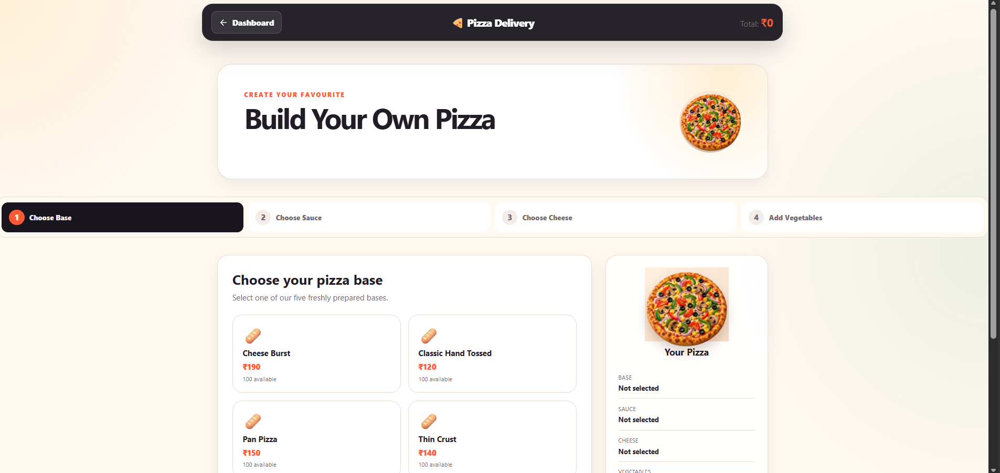
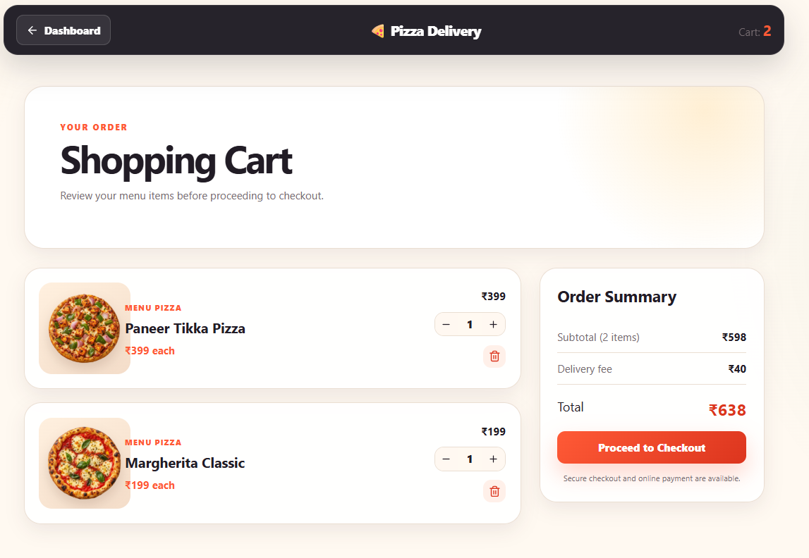
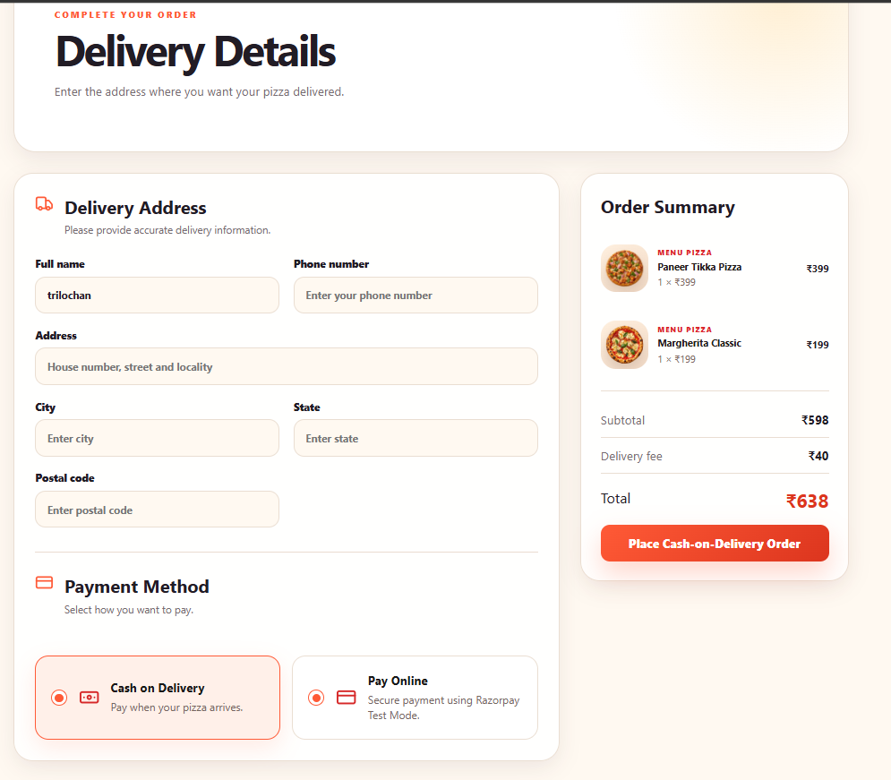
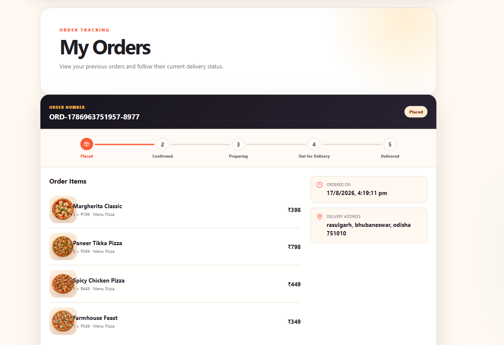
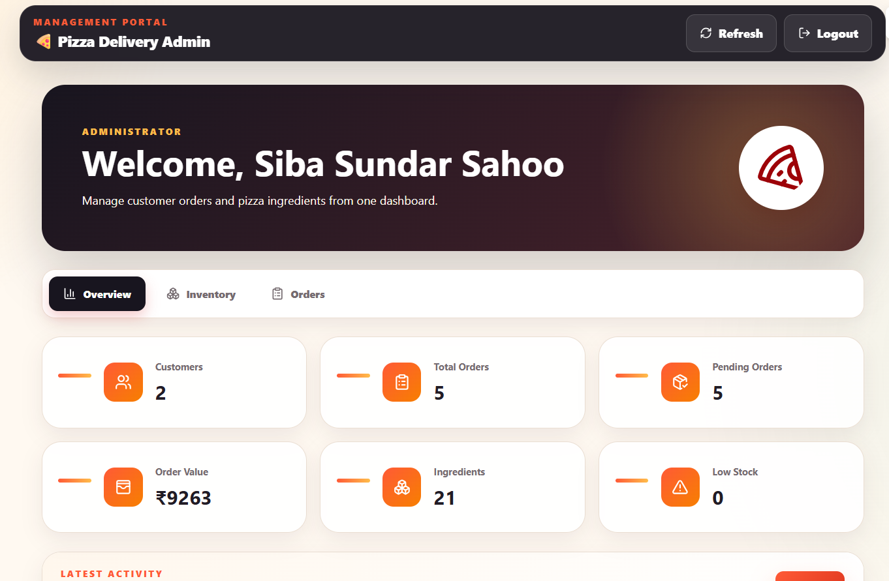
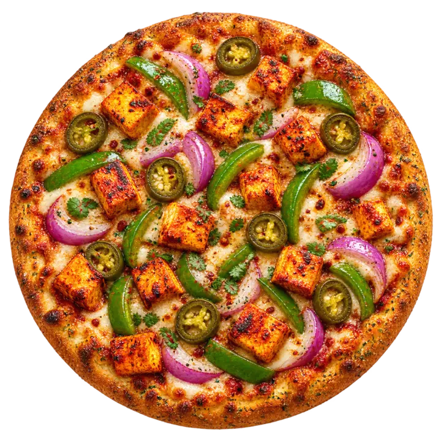
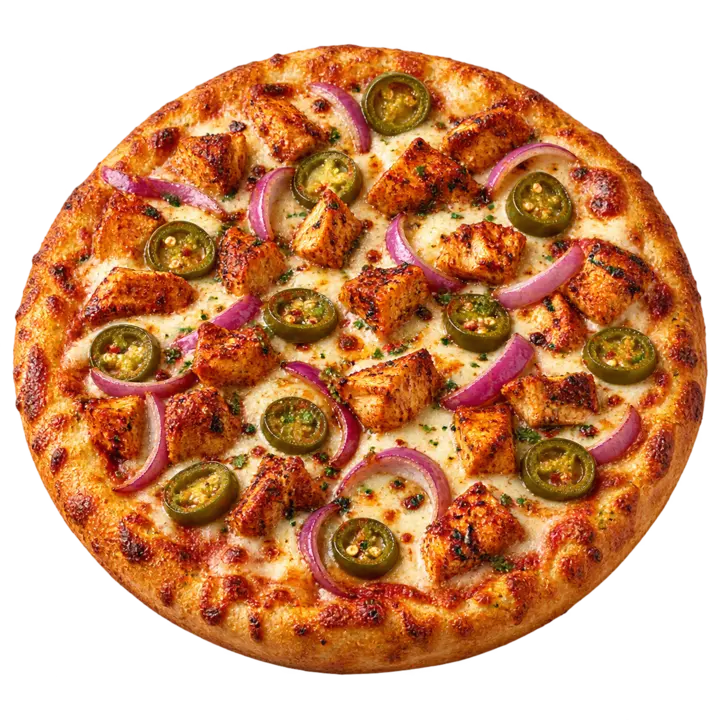
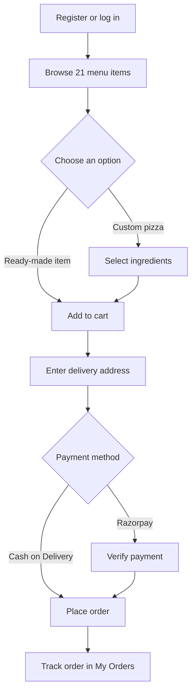

# 🍕 Pizza Delivery Platform

<div align="center">

**A full-stack pizza ordering application with a custom pizza builder, secure authentication, online payments, order tracking, and an admin dashboard.**

[](https://react.dev/)
[](https://nodejs.org/)
[](https://www.mongodb.com/)
[](https://oibsip-pizza-delivery-siba-jade.vercel.app/)
[](https://oibsip-pizza-delivery-siba.onrender.com/api/health)

[Live Application](https://oibsip-pizza-delivery-siba-jade.vercel.app/) · [Backend Health](https://oibsip-pizza-delivery-siba.onrender.com/api/health) · [Report an Issue](https://github.com/sibasundarsahoo08-creator/OIBSIP/issues)

</div>

---

## About the project

This project was developed for the **Oasis Infobyte Web Development Internship — Level 3 Pizza Delivery Application**. It provides a complete ordering experience for customers and a dedicated management interface for administrators.

The application uses the custom **Ember & Basil** visual theme, featuring charcoal navigation, warm restaurant-inspired surfaces, circular product imagery, and responsive layouts for desktop and mobile screens.

## Application preview

### Customer dashboard

<div align="center">



</div>

### Main customer workflow

<table>
  <tr>
    <td width="50%" align="center">
      
      <br><b>Build Your Own Pizza</b>
    </td>
    <td width="50%" align="center">
      
      <br><b>Shopping Cart</b>
    </td>
  </tr>
  <tr>
    <td width="50%" align="center">
      
      <br><b>Secure Checkout</b>
    </td>
    <td width="50%" align="center">
      
      <br><b>My Orders</b>
    </td>
  </tr>
</table>

### Administration

<div align="center">



</div>

## Food catalogue preview

<table>
  <tr>
    <td width="33%" align="center">
      
      <br><b>Margherita Classic</b>
    </td>
    <td width="33%" align="center">
      
      <br><b>Tandoori Paneer Blaze</b>
    </td>
    <td width="33%" align="center">
      
      <br><b>Spicy Chicken Pizza</b>
    </td>
  </tr>
  <tr>
    <td width="33%" align="center">
      
      <br><b>Cheesy Garlic Bread</b>
    </td>
    <td width="33%" align="center">
      
      <br><b>Crispy Chicken Wings</b>
    </td>
    <td width="33%" align="center">
      
      <br><b>Orange Fizz</b>
    </td>
  </tr>
</table>

## Key features

### Customer experience

- Secure registration and login using JWT authentication
- Email verification, resend verification, and password recovery
- Expanded catalogue containing **21 products**
  - 10 pizzas
  - 6 starters
  - 5 cold drinks
- Category tabs and product search
- Custom pizza builder with base, sauce, cheese, vegetable, and topping selections
- Shopping cart with quantity controls and item images
- Delivery address and checkout workflow
- Cash on Delivery and Razorpay payment options
- Order history with item details, totals, payment method, and order status
- Responsive interface for desktop, tablet, and mobile devices

### Administrator experience

- Protected admin dashboard
- Business overview and catalogue management
- Inventory monitoring and updates
- Customer order management
- Order-status controls for the fulfilment workflow

## Live deployment

| Service | Deployment | URL |
| --- | --- | --- |
| Frontend | Vercel | [Open application](https://oibsip-pizza-delivery-siba-jade.vercel.app/) |
| Backend API | Render | [Check API health](https://oibsip-pizza-delivery-siba.onrender.com/api/health) |
| Database | MongoDB Atlas | Cloud database |

> The backend uses Render's free service tier and may need a short time to wake up after a period of inactivity.

## Technology stack

| Layer | Technologies |
| --- | --- |
| Frontend | React, Vite, React Router, Axios, CSS |
| Backend | Node.js, Express.js |
| Database | MongoDB Atlas, Mongoose |
| Authentication | JWT, bcrypt.js, email verification |
| Email | Nodemailer |
| Payments | Razorpay |
| Security | Helmet, CORS, rate limiting, input validation |
| Deployment | Vercel, Render, MongoDB Atlas |

## Project structure

```text
OIBSIP/
├── README.md
└── WebDev-L3-PizzaDelivery/
    ├── backend/
    │   ├── config/
    │   ├── controllers/
    │   ├── middleware/
    │   ├── models/
    │   ├── routes/
    │   ├── scripts/
    │   │   └── seedCatalog.js
    │   ├── utils/
    │   ├── .env
    │   ├── package.json
    │   └── server.js
    ├── docs/
    │   └── screenshots/
    │       ├── admin-dashboard.png
    │       ├── cart.png
    │       ├── checkout.png
    │       ├── dashboard.png
    │       ├── my-orders.png
    │       └── pizza-builder.png
    └── frontend/
        ├── public/
        │   ├── menu/
        │   └── pizzas/
        ├── src/
        │   ├── components/
        │   ├── pages/
        │   ├── utils/
        │   │   └── menuImages.js
        │   ├── App.css
        │   ├── App.jsx
        │   └── unique-interface-theme.css
        ├── package.json
        └── vite.config.js
```

## Run locally

### Prerequisites

Install the following tools before starting:

- [Node.js](https://nodejs.org/) 18 or newer
- [Git](https://git-scm.com/)
- A [MongoDB Atlas](https://www.mongodb.com/atlas) database
- A mail account/app password for verification emails
- Razorpay test credentials if online payment testing is required

### 1. Clone the repository

```bash
git clone https://github.com/sibasundarsahoo08-creator/OIBSIP.git
cd OIBSIP/WebDev-L3-PizzaDelivery
```

### 2. Configure and start the backend

```bash
cd backend
npm install
```

Create `backend/.env` and add the environment variables required by the server. A typical configuration includes:

```env
PORT=5000
MONGODB_URI=your_mongodb_connection_string

JWT_ACCESS_SECRET=your_long_random_access_secret
JWT_REFRESH_SECRET=your_long_random_refresh_secret

CLIENT_URL=http://localhost:5173

MAIL_SERVER=smtp.gmail.com
MAIL_PORT=587
MAIL_USERNAME=your_email_address
MAIL_PASSWORD=your_email_app_password
MAIL_DEFAULT_SENDER=your_email_address

RAZORPAY_KEY_ID=your_razorpay_test_key_id
RAZORPAY_KEY_SECRET=your_razorpay_test_key_secret
```

> Never commit the `.env` file or expose passwords, JWT secrets, database credentials, or Razorpay secrets.

Seed the catalogue and start the development server:

```bash
node scripts/seedCatalog.js
npm run dev
```

The API should be available at `http://localhost:5000`.

### 3. Configure and start the frontend

Open a second terminal:

```bash
cd frontend
npm install
```

Create `frontend/.env` when an API URL is required by the current frontend configuration:

```env
VITE_API_URL=http://localhost:5000/api
```

Start the application:

```bash
npm run dev
```

Open `http://localhost:5173` in your browser.

## Production build

Build and preview the frontend locally:

```bash
cd frontend
npm run build
npm run preview
```

Before deployment, verify that:

- The frontend production environment points to the deployed backend API.
- The backend allows the deployed frontend origin through CORS.
- MongoDB Atlas permits connections from the backend host.
- All required backend environment variables are configured on Render.
- Secret files such as `.env` are excluded by `.gitignore`.

## Main workflows



## Testing checklist

- Register, verify an email address, log in, and recover a password
- Browse all 21 products and filter each category
- Search for products by name
- Build a custom pizza and add it to the cart
- Add pizzas, starters, and drinks to the cart
- Increase and decrease quantities
- Complete a Cash on Delivery order
- Test Razorpay using test-mode credentials
- Confirm the order appears in My Orders
- Log in as an administrator and update an order status
- Verify the interface at desktop, tablet, and mobile widths
- Run `npm run build` successfully in the frontend
- Check the deployed backend health endpoint

## API overview

The backend is organised into route modules for:

- Authentication and user accounts
- Catalogue and ingredients
- Cart and checkout operations
- Orders and payment verification
- Inventory and administrator operations

For a quick deployment test, open the [API health endpoint](https://oibsip-pizza-delivery-siba.onrender.com/api/health).

## Future improvements

- Live delivery tracking on a map
- Discount coupons and loyalty points
- Product reviews and ratings
- Push notifications for order updates
- Restaurant analytics and sales reports
- Progressive Web App support

## Project report

A detailed project report covering architecture, features, security, testing, deployment and development outcomes is available below:

[Download the complete project report](WebDev-L3-PizzaDelivery/docs/Siba_Sundar_Sahoo_Pizza_Delivery_Project_Report.pdf)

## Author

**Siba Sundar Sahoo**

- GitHub: [sibasundarsahoo08-creator](https://github.com/sibasundarsahoo08-creator)
- Project repository: [OIBSIP](https://github.com/sibasundarsahoo08-creator/OIBSIP)

---

<div align="center">

Developed as part of the **Oasis Infobyte Web Development Internship**.

</div>

